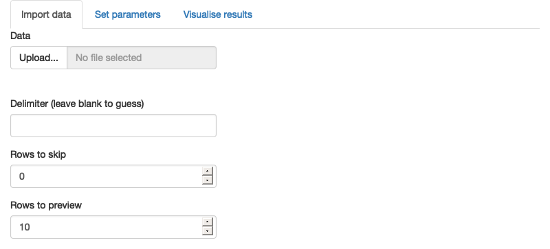

class: center, middle

.linea-superior[]
.linea-inferior[]


## INE educa: Clases abiertas de R

## Introducción a Shiny 

## Proyecto de Ciencia de Datos

### Junio 2023

```{r setup, include=FALSE}
options(htmltools.dir.version = TRUE)
knitr::opts_chunk$set(message = FALSE, warning = F, eval = T) 
options(scipen = "999")
```

```{r xaringan-themer, include=FALSE, warning=FALSE}
library(xaringanthemer)
library(xaringanExtra)

```


```{r xaringanExtra-clipboard, echo=FALSE}
xaringanExtra::use_clipboard()
xaringanExtra::use_panelset()

```

```{r include=FALSE,results=F}

#### documentacion
# https://garthtarr.github.io/sydney_xaringan/#1
# video to gif
# https://www.veed.io/edit/93bf87f3-ace0-4b14-9b4b-f59c6a496dda/convert?source=%2Fconvert%2Fwebm-to-gif&outputFormat=gif

# Planificar tu app
#       - Aplicacion monitoreando nombres   
#        - Debuging rapido.
#        - GIT !!!
# 
# - Posibilidades para montar una Shiny App
#   - shinyapps.io
#   - ShinyServer
#   - docker+Shiny
#   - docker+ShinyServer
#   - docker+ShinyProxy
#   - docker+compose/swarn
#       
# --
# 
# - Paquetes complementarios 
#   - Shinythmae (ui)
#   - Leaflet (trabajo con mapas y datos georefenciados)
#   - Golem (Desarrollo de apps)
#   - Rhino (Desarrollo de apps) [https://rhinoverse.dev/#rhino](https://rhinoverse.dev/#rhino) 
#   - ShinyManager (autenticación)
#   - usar runExample(NA)
#          runExample("03_reactivity")
#          runExample("04_mpg")
#          runExample("05_sliders")

# - Material util 
#  - https://shiny.posit.co/r/gallery/
#  - Libro hadley Whickam https://mastering-shiny.org

# 
# 
# --
# 
# 
# - Que viene?
#     - Shiny fot python
#     - R in the browser
# 


```

---
background-image: url("imagenes/fondo2.PNG")
background-size: contain;
background-position: 100% 0%

# Pero antes que todo!!!

Trabajaremos con los siguientes paquetes, les invitamos a instalarlos para seguir la clase:

```{r eval = F}

install.packages(c("shiny","guaguas","dplyr","ggplot2",
                   "calidad","survey","writexl"))

library(shiny)
library(guaguas)
library(dplyr)
library(ggplot2)
library(calidad)
library(survey)
library(writexl)

#### versión de R 4.2.3 (2023-03-15)
```

.center[]

---


background-image: url("imagenes/fondo2.PNG")
background-size: contain;
background-position: 100% 0%


# Estructura del taller

**Contenidos de la clase**

- I - Motivación

--

- II - Ejemplos de Shiny Apps construidas en el INE

--

- III - Principales características de una Shiny App

--

- IV - ¡A construir una Shiny App!

--

- V - Tips y referencias
      
      
<br>
<br>      
      
      
--


**Objetivos de la clase:**

-  Orientar sobre la construcción de una Shiny App


---

class: inverse, center, middle

# I. Motivación

---
background-image: url("imagenes/fondo2.PNG")
background-size: contain;
background-position: 100% 0%

# ¿Shiny?

.panelset[
.panel[.panel-name[¿Que es Shiny?]

<br>

.center[.font130[Es un paquete de R, que simplifica la construcción de plataformas interactivas para personas que vienen de disciplinas lejanas a la programación web o desde la ciencia y analítica de datos]]


<br>
<br>


.center[.font130[Shiny es un **"wrapper"** de html, css y JavaScript, los principales lenguajes para construir aplicaciones web]]

]

.panel[.panel-name[¿Porque utilizar Shiny?]


.Large[.center[.red.bold[Interactividad!!!]]] 

Clickear, cargar datos, cambiar parámetros...


*¿Para qué?*

  - Resultados de análisis de una investigación (shiny empresas)
  - Disponibilizar alguna herramienta (paquete de calidad)
  - Evaluar el avance de una investigación, (esto nos ahorra mucho código)
  - Simplemente automatizar un proceso tedioso
  


*Usuarios finales*
  - Usuarios que no sepan programar
  - Cada uno/a mismo!
  ]
  
]

---
class: inverse, center, middle

# II - Algunos ejemplos de Shiny Apps construidas en el INE

---
class: black_background


---
class: black_background


---

class: inverse, center, middle

# III. Principales características de Shiny App


```{r include=F}


# ---
# background-image: url("imagenes/fondo2.PNG")
# background-size: contain;
# background-position: 100% 0%
# 
# # Principales características de Shiny App
# 
# Estos son los componentes principales de una Shiny App
# 
# -ui
# 
# -server
# 
# -shinyApp(ui,server)
# 
# -inputs
# 
# -outputs
# 
# -¿reactividad? reactive({}) y observeEvent({})
# 
# -acctionButton
# 
# -isolate
# 
# -downloadHandler
# 
# */

```
  
---

background-image: url("imagenes/fondo2.PNG")
background-size: contain;
background-position: 100% 0%

# Shiny como aplicaciones web

.pull-left[


]

--

.pull-right[
<br>
<br>
<br>


]


---

background-image: url("imagenes/fondo2.PNG")
background-size: contain;
background-position: 100% 0%

# Principales características de Shiny App

Componentes básicos de una Shiny App

--

- **ui**: *(user interface)* Este objeto controla el diseño y la apariencia de la aplicación

--

- **server**: Esta función contiene las instrucciones que R necesita para construir la aplicación

--

- **shinyApp**(ui,server): Corre la app uniendo los dos elementos anteriores

--

```{r eval=F}

library(shiny)

ui <- fluidPage(
  
)

server <- function(input, output, session) {  
  
}

shinyApp(ui, server)

```

--

**¿Como comenzamos un proyecto en Shiny?**

--

Veamos el código!!!...

```{r eval=F, include=F}

# Acá el presentador abre Rstudio y muestra como generar una shinyApp desde la generación de un nuevo script con el mouse.
# Explica las principales características 


```

---

class: inverse, center, middle

# IV. ¡A construir una Shiny App!

---
background-image: url("imagenes/fondo2.PNG")
background-size: contain;
background-position: 100% 0%

# Como construi la ui

.panelset[
.panel[.panel-name[sidebarLayout]

**sidebarLayout()**

.pull-left[

```{r eval=FALSE}

ui <- fluidPage(
  titlePanel("Central limit theorem"),
  sidebarLayout(
    sidebarPanel(
      numericInput("m", "Number of samples:", 2, min = 1, max = 100)
    ),
    mainPanel(
      plotOutput("hist")
    )
  )
)

##### * este código es solo de ejemplo, no está completo para generar una app
```

]

.pull-right[

.right[]


]

]


.panel[.panel-name[tabsetPanel]

**tabsetPanel()**

.pull-left[

```{r eval=FALSE}

ui <- fluidPage(
  tabsetPanel(
    tabPanel("Import data", 
      fileInput("file", "Data", buttonLabel = "Upload..."),
      textInput("delim", "Delimiter (leave blank to guess)", ""),
      numericInput("skip", "Rows to skip", 0, min = 0),
      numericInput("rows", "Rows to preview", 10, min = 1)
    ),
    tabPanel("Set parameters"),
    tabPanel("Visualise results")
  )
)

##### * este código es solo de ejemplo, no está completo para generar una app
```
]

.pull-right[
 
 .right[]

]

]


.panel[.panel-name[navbarPage]
**navbarPage()**


.pull-left[
```{r eval=FALSE}

ui <- fluidPage(
  navbarPage("App Title",
             tabPanel("Plot"),
             tabPanel("Summary"),
             tabPanel("Table")
  )
)

##### * este código es solo de ejemplo, no está completo para generar una app
```
]

.pull-right[

.right[]
]

]

]


--


---
background-image: url("imagenes/fondo2.PNG")
background-size: contain;
background-position: 100% 0%

# Veamos como construir la ui

Shiny posee funciones que nos permiten agregar contenidos para mejorar nuestra ui, estas funciones son "**wrapper**" de html.

.center[]

---
background-image: url("imagenes/fondo2.PNG")
background-size: contain;
background-position: 100% 0%

# Veamos como construir la ui

Shiny posee funciones que nos permiten agregar contenidos para mejorar nuestra ui, estas funciones son "**wrapper**" de html.

.center[]

---

class: inverse, center, middle

# Pero... ¿Como el usuario interactua con la ui?

---
background-image: url("imagenes/fondo2.PNG")
background-size: contain;
background-position: 100% 0%

# Con widgets!


Se dividen entre **INPUTS** y **OUTPUTS**, ya que como sus nombres lo indican es donde ingresamos parametros y donde recibimos los productos procesados

<br>

.center[]


---
background-image: url("imagenes/fondo2.PNG")
background-size: contain;
background-position: 100% 0%

# Inputs 

Funciones que permiten al usuario ingresar parametros o información a la app, es por ello que van desde la **ui** al **server**

Parámetros básicos:

--

**inputId:** Es el nombre que le damos al input en particular, para luego poder acceder

--

**label:** Es la etiqueta que el usuario lee sobre el input

--

Son almacenados dentro de una lista llamada: **input**, para acceder a ellos debemos buscarlos en esa lista, tal y como se hace en **R**:

```{r eval=F}

ui <- fluidPage(
  numericInput(inputId = "variable1",label = "Variable 1",value = 30)
)

##### * este código es solo de ejemplo, no está completo para generar una app
```

<br>

.center[.color_style_black[input$].color_style_burdeo[variable1]]

---
background-image: url("imagenes/fondo2.PNG")
background-size: contain;
background-position: 100% 0%

# Inputs 

Reciben un tipo de dato en particular, sea  **texto**, **numérico**, **factores** o **fechas**, entre otros,

<br>

.center[] [*](https://www.paulamoraga.com/book-geospatial/sec-shiny.html)

---
background-image: url("imagenes/fondo2.PNG")
background-size: contain;
background-position: 100% 0%

# Outputs 

- Lo que la app nos devuelve, pueden ser gráficos, imágenes, tablas, texto e incluso mapas


.center[] [*](https://www.paulamoraga.com/book-geospatial/sec-shiny.html)


--

- Los outputs se generan en el **server** de la aplicación y viajan hacia la **ui**

--

- Al igual que los inputs los outputs son almacenados dentro de una lista, llamada: **output**:

--

```{r eval=F}

server <- function(input, output, session) {

output$plot1 <- renderPlot({
    grafico
  })
}

##### * este código es solo de ejemplo, no está completo para generar una app
```


.center[.color_style_black[output$].color_style_burdeo[plot1]]

---
background-image: url("imagenes/fondo2.PNG")
background-size: contain;
background-position: 100% 0%

# Outputs

<br>

Para enviar los **outputs** desde el server hacia el ui, la manera de hacerlo es la siguiente: 

<br>

```{r eval=F}

ui <-fluidPage(
  plotOutput("plot1")
)

server <- function(input, output, session) {

output$plot1 <- renderPlot({
    grafico
  })
}

##### * este código es solo de ejemplo, no está completo para generar una app
```

---
class: inverse, center, middle

# Vamos al código!!!...     

---
background-image: url("imagenes/fondo2.PNG")
background-size: contain;
background-position: 100% 0%

# Construyendo una app que busca nombres

Usaremos el paquete [guaguas](https://github.com/rivaquiroga/guaguas)

```{r eval=F}

library(shiny)
library(guaguas)
library(dplyr)
library(ggplot2)

{{datos <- guaguas %>% dplyr::filter(n >= 100)}}

ui <- fluidPage(
  titlePanel("Buscando nombres"),
      sidebarLayout(
        sidebarPanel(h3("Inputs"),
                    selectInput(inputId = "nombre",
                    label = "Nombres",
{{                    choices = unique(datos$nombre))}}
    ),
    mainPanel(h3("Outputs"),
              plotOutput(outputId = "frecuencia_guaguas")
    )
  )
)

server <- function(input, output, session) {
  grafico <-  datos %>%
{{    dplyr::filter(nombre == input$nombre) %>% }}
    ggplot(aes(anio,n)) +
    geom_line()
  
  output$frecuencia_guaguas <- renderPlot({
    grafico
  })
}
shinyApp(ui, server)

```


---
background-image: url("imagenes/fondo2.PNG")
background-size: contain;
background-position: 100% 0%

# ¿Que es la reactividad?

Este es el error típico aprendiendo Shiny:

**"Caused by error in `input$nombre`:
! Can't access reactive value 'nombre' outside of reactive consumer.
ℹ Do you need to wrap inside reactive() or observe()?"**

--

.color_style_burdeo[En español:]

**"Provocado por error en input$nombre: ! No se puede acceder al valor reactivo 'nombre' fuera del consumidor reactivo
¿Necesita envolver dentro de reactivo() u observar()?"**

--

.color_style_burdeo[En sencillo:]

- La **reactividad**, es el mecanismo por el cual Shiny determina que objeto de R tiene que cambiar, cuándo el usuario realiza alguna acción o genera un input.

- Estos inputs se deben tratar de manera especial, siempre "envueltos" en funciones **reactivas** u **observadoras** (ya lo veremos)


---
background-image: url("imagenes/fondo2.PNG")
background-size: contain;
background-position: 100% 0%

# Construyendo una app que busca nombres

.center[.Large[Ahora sí!]]

```{r eval=F}

library(shiny)
library(guaguas)
library(dplyr)
library(ggplot2)

datos <- guaguas %>% dplyr::filter(n >= 100)

ui <- fluidPage(
  titlePanel("Buscando nombres"),
      sidebarLayout(
        sidebarPanel(h3("Inputs"),
                    selectInput(inputId = "nombre",
                    label = "Nombres",
                    choices = unique(datos$nombre))
             ),
        mainPanel(h3("Outputs"),
                  plotOutput(outputId = "frecuencia_guaguas")
                   )
          )
)


server <- function(input, output, session) {

grafico <- reactive({datos %>% 
      dplyr::filter(nombre == input$nombre) %>%
      ggplot(aes(anio,n)) +
      geom_line()
    }) 
  
  output$frecuencia_guaguas <- renderPlot({
{{ grafico() }}
  })

}

shinyApp(ui, server)

```


---
background-image: url("imagenes/fondo2.PNG")
background-size: contain;
background-position: 100% 0%

# ¿Que es la reactividad?

 ¿Si queremos controlar cuando se genera el gráfico? y así se pueden agregar mas nombres en la búsqueda...
 
--

Como ya se mencionó existen dos grupos de funciones que reciben a los objetos reactivos, las funciones **reactivas** y las funciones que **observan**

--

A diferencia de las funciones **reactivas**, las funciones que **observan** permiten que pasen acciones secundarias, pero no generan un objeto nuevo

--

En el siguente ejemplo podemos ver como la función **observeEvent({})** recibe cómo argumento el input *input$generar_gráfico*, solo después de que este input sea generado, el gráfico se creará

```{r, eval=F}

observeEvent(input$generar_gráfico,{  
  
  output$frecuencia_guaguas <- renderPlot({
grafico()
  })
  
  })

##### * este código es solo de ejemplo, no está completo para generar una app
```

--

Vamos al código!!!...

---
background-image: url("imagenes/fondo2.PNG")
background-size: contain;
background-position: 100% 0%

# ¿Que es la reactividad?

.panelset[
.panel[.panel-name[v1]

- Agreguemos un botón para generar un gráfico

```{r eval=F}
library(shiny)
library(guaguas)
library(dplyr)
library(ggplot2)

## Agregamo el botón
# actionButton(inputId = "generar_gráfico",label = "Generar gráfico")

### Generamos un botón que controle la generación del gráfico
# observeEvent(input$generar_gráfico,{  
#   output$frecuencia_guaguas <- renderPlot({
#     grafico()
#   })
# })

# isolate({grafico()})


datos <- guaguas %>% dplyr::filter(n >= 100)


ui <- fluidPage(
  titlePanel("Buscando nombres"),
  sidebarLayout(
    sidebarPanel(h3("Inputs"),
                 selectInput(inputId = "nombre",
                             label = "Nombres",
                             choices = unique(datos$nombre))
    ),
    mainPanel(h3("Outputs"),
              plotOutput(outputId = "frecuencia_guaguas")
    )
  )
)

server <- function(input, output, session) {
  
  grafico <- reactive({datos %>%
      dplyr::filter(nombre == input$nombre) %>%
      ggplot(aes(anio,n)) +
      geom_line()
  })
  
  output$frecuencia_guaguas <- renderPlot({
    grafico()
  })
}
shinyApp(ui, server)

```

]

.panel[.panel-name[v2]
- Permitamos que se puedan buscar más nombres

```{r eval=F}
library(shiny)
library(guaguas)
library(dplyr)
library(ggplot2)

### permitimos que se busquen mas nombres ###
# selectInput(inputId = "nombre",
#             label = "Nombres",
#             choices = unique(datos$nombre),multiple = T),

# datos %>% 
# dplyr::filter(nombre %in% input$nombre) %>%
#   ggplot(aes(anio,n,color=nombre)) +
#   geom_line()

datos <- guaguas %>% dplyr::filter(n >= 100)


ui <- fluidPage(
  titlePanel("Buscando nombres"),
  sidebarLayout(
    sidebarPanel(h3("Inputs"),
                 selectInput(inputId = "nombre",
                             label = "Nombres",
                             choices = unique(datos$nombre)),
                 actionButton(inputId = "generar_gráfico",label = "Generar gráfico")
    ),
    mainPanel(h3("Outputs"),
              plotOutput(outputId = "frecuencia_guaguas")
    )
  )
)

server <- function(input, output, session) {
  
  grafico <- reactive({datos %>%
      dplyr::filter(nombre == input$nombre) %>%
      ggplot(aes(anio,n)) +
      geom_line()
  })
  
observeEvent(input$generar_gráfico,{  
  output$frecuencia_guaguas <- renderPlot({
    isolate({grafico()})
  })
})  
  
}
shinyApp(ui, server)

```

]

]

---
background-image: url("imagenes/fondo2.PNG")
background-size: contain;
background-position: 100% 0%

# ¿Entonces que es la aislación?

```{r eval=F}

# isolate({input$valor1})  * isolate({ input$valor2})

library(shiny)

ui <- fluidPage(
  numericInput("valor1","Valor 1",value = 10),

  br(),
  br(),

  numericInput("valor2","Valor 2",value = 10),

  br(),
  br(),

  verbatimTextOutput("resultado"),

  br() ,
  br() ,


  actionButton("calc_btn","Calcular")

)

server <- function(input, output, session) {

observeEvent(input$calc_btn,{
  {{print(input$calc_btn)}}
  
  output$resultado = renderText({

    input$valor1  *  input$valor2

  })

})


}

shinyApp(ui, server)


```

---
background-image: url("imagenes/fondo2.PNG")
background-size: contain;
background-position: 100% 0%

# Un ejemplo para el trabajo diario

--

- La siguiente shiny App genera cálculos de estadísticas publicadas por él INE, específicamente la Encuesta Nacional Urbana de Seguridad Ciudadana

--

- Esta app aplica el [estándar](https://www.ine.gob.cl/docs/default-source/institucionalidad/buenas-pr%C3%A1cticas/clasificaciones-y-estandares/est%C3%A1ndar-evaluaci%C3%B3n-de-calidad-de-estimaciones-publicaci%C3%B3n-27022020.pdf) de calidad definido por el INE para evaluar la calidad de las estadísticas publicadas

--

- Estos cálculos se realizan utilizando el paquete de [calidad](https://cran.r-project.org/web/packages/calidad/vignettes/tutorial.html)  desarrollado en R que aplica el [estándar](https://www.ine.gob.cl/docs/default-source/institucionalidad/buenas-pr%C3%A1cticas/clasificaciones-y-estandares/est%C3%A1ndar-evaluaci%C3%B3n-de-calidad-de-estimaciones-publicaci%C3%B3n-27022020.pdf)

--

- Este paquete es un **wrapper** del paquete [survey](https://cran.r-project.org/web/packages/survey/index.html) aplicado al [estándar](https://www.ine.gob.cl/docs/default-source/institucionalidad/buenas-pr%C3%A1cticas/clasificaciones-y-estandares/est%C3%A1ndar-evaluaci%C3%B3n-de-calidad-de-estimaciones-publicaci%C3%B3n-27022020.pdf) INE

.center[]

--

**Él es Thomas Lumley, su creador**

--


---
background-image: url("imagenes/fondo2.PNG")
background-size: contain;
background-position: 100% 0%

# Un ejemplo para el trabajo diario 

.panelset[
.panel[.panel-name[v1]

Veamos como funciona

```{r eval=F}

library(shiny)
library(calidad)
library(survey)
### declaramos diseño complejo
com_dis <- svydesign(ids = ~Conglomerado,
                     strata = ~VarStrat,
                     weights = ~Fact_Pers,data = enusc)
options(survey.lonely.psu = "certainty")
## APP #
### UI ####
ui <- fluidPage(
  titlePanel("Probando paquete calidad del INE"),
  sidebarLayout(sidebarPanel(
{{    selectInput("var",label = "Variable de interés",choices = c("",names(enusc)),selected = "")), }}
    mainPanel(tableOutput("tabla")
    )
  )
)
  ### SERVER ####
  
server <- function(input, output, session) {
    ### generamos tabla
    tabulado <- reactive({
  {{    calidad::assess(calidad::create_prop(var = input$var, design = com_dis)) }}
    })
    output$tabla <- renderTable({
   #   req(input$var)
      tabulado()
    })
  }
  
  shinyApp(ui, server)


```

]

.panel[.panel-name[v2]

- ¿Que implica agregar un nivel de desagregación a los cálculos?

```{r eval=F}

library(shiny)
library(calidad)
library(survey)


### declaramos diseño complejo
com_dis <- svydesign(ids = ~Conglomerado,
                     strata = ~VarStrat,
                     weights = ~Fact_Pers,data = enusc)

options(survey.lonely.psu = "certainty")


## APP #

### UI ####
ui <- fluidPage(
  titlePanel("Probando paquete calidad del INE"),
  sidebarLayout(sidebarPanel(
    selectInput("var",label = "Variable de interés",choices = c("",names(enusc)),selected = ""),
  #  selectInput("dominio",label = "Variable desagregacion",choices = c("",names(enusc)),selected = ""),
    downloadButton("download_tabla","Descarga")),
                mainPanel(tableOutput("tabla")
                          ))
)

### SERVER ####
server <- function(input, output, session) {

  # R_dominio = reactive({
  #   # print(input$dominio)
  #
  #   if(input$dominio == ""){
  #     NULL
  #   }else{
  #     input$dominio
  #   }
  # })

### generamos tabla
  tabulado <- reactive({
  calidad::assess(calidad::create_prop(var = input$var,
              #  domains = #R_dominio(),
                design = com_dis))
  })


  output$tabla <- renderTable({
# req(input$var)

tabulado()

    })

}

shinyApp(ui, server)


```

  ]
  
  .panel[.panel-name[v3]

- ¿Y si quisiéramos descargar los tabulados a nuestro equipo?

```{r eval=F}

library(shiny)
library(calidad)
library(survey)


### declaramos diseño complejo
com_dis <- svydesign(ids = ~Conglomerado,
                     strata = ~VarStrat,
                     weights = ~Fact_Pers,data = enusc)

options(survey.lonely.psu = "certainty")


## APP #

### UI ####
ui <- fluidPage(
  titlePanel("Probando paquete calidad del INE"),
  sidebarLayout(sidebarPanel(
    selectInput("var",label = "Variable de interés",choices = c("",names(enusc)),selected = ""),
    selectInput("dominio",label = "Variable desagregacion",choices = c("",names(enusc)),selected = ""),
#    downloadButton("download_tabla","Descarga")
),
                mainPanel(tableOutput("tabla")
                          ))
)

### SERVER ####
server <- function(input, output, session) {

  R_dominio = reactive({
    # print(input$dominio)

    if(input$dominio == ""){
      NULL
    }else{
      input$dominio
    }
  })

### generamos tabla
  tabulado <- reactive({
  calidad::assess(calidad::create_prop(var = input$var,
                domains = R_dominio(),
                design = com_dis))
  })


  output$tabla <- renderTable({
req(input$var)

    # print(R_dominio)
    # print(R_denom)

tabulado()

    })


  # output$download_tabla <- downloadHandler(
  #   filename = function() {
  #     paste0("tabulado-", format(Sys.time(),"%Y-%m-%d-%H%M%S"), ".xlsx", sep="")
  #   },
  #   content = function(file) {
  #     writexl::write_xlsx(tabulado(), file)
  #   }
  # )
}

shinyApp(ui, server)


```

  ]


]


---

class: inverse, center, middle

# V. Tips y referencias

---
background-image: url("imagenes/fondo2.PNG")
background-size: contain;
background-position: 100% 0%

# Algunos tips

--

- Planificar tu app

--

- Explorar técnicas de debugging (**print()** es tu copiloto)
        
--
        
- GIT !!!

--

- Posibilidades para montar en la web una Shiny App
   - shinyapps.io
   - ShinyServer
   - Docker+Shiny o ShinyServer
   - ShinyProxy 
   
   
   .right[]

---
background-image: url("imagenes/fondo2.PNG")
background-size: contain;
background-position: 100% 0%

# Paquetes complementarios 

- Shinytheme (ui) https://rstudio.github.io/shinythemes/

--

- shinydashboard (ui) https://rstudio.github.io/shinydashboard/

--

- Leaflet (trabajo con mapas y datos georefenciados) https://rstudio.github.io/leaflet/shiny.html

--

- Golem (Desarrollo de apps) https://thinkr-open.github.io/golem/

--

- Rhino (Desarrollo de apps) https://rhinoverse.dev/#rhino

--

- ShinyManager (autenticación) https://datastorm-open.github.io/shinymanager/

--

- Recursos de shiny para aprender, usar comandos:
    - shiny::runExample(NA)
    - shiny::runExample("03_reactivity")
    - shiny::runExample("04_mpg")
    - shiny::runExample("05_sliders")... hasta el 11
      
--

- ¿Que viene respecto a Shiny?
     - Shiny for python
     - R in the browser
 
 
---
background-image: url("imagenes/fondo2.PNG")
background-size: contain;
background-position: 100% 0%

# Material utilizado para esta clase 


- https://shiny.posit.co/r/gallery/

  
- Libro hadley Whickam https://mastering-shiny.org


- Libro golem https://engineering-shiny.org/golem.html


- Cheat sheet shiny https://ugoproto.github.io/ugo_r_doc/pdf/shiny.pdf
  
---

class: center, middle

.linea-superior[]
.linea-inferior[]


## INE educa: Clases abiertas de R

## Proyecto de Ciencia de Datos

### Junio 2023
